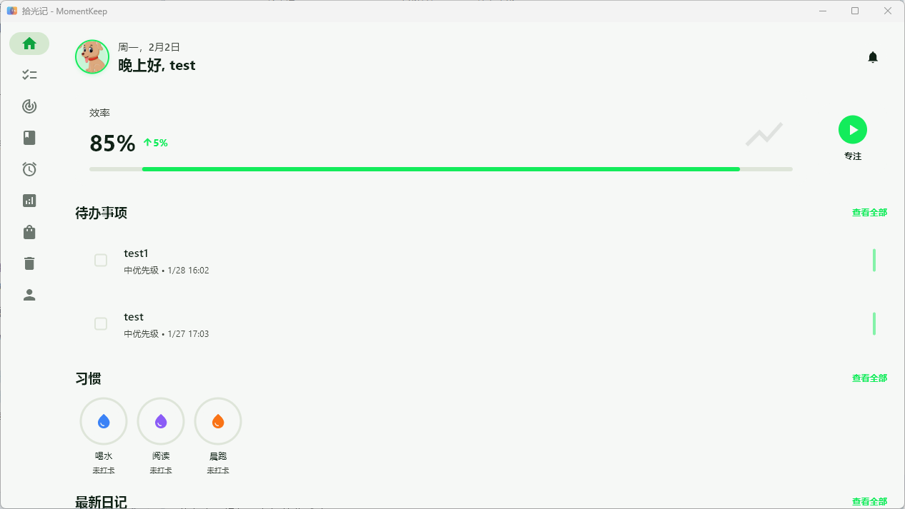

# 拾光记 (Moment Keep)

[](https://flutter.dev)
[](https://flutter.dev)
[](LICENSE)

## 项目介绍

拾光记是一款功能丰富的多平台习惯追踪和个人管理应用，帮助用户养成良好习惯，提高工作效率，记录生活点滴。通过直观的界面和强大的功能，为用户提供全方位的个人管理解决方案。



## 功能特性

### 核心功能
- **待办事项管理**：创建、编辑、删除待办事项，标记完成状态，设置优先级，支持子任务
- **习惯打卡与追踪**：创建习惯，设置提醒，记录打卡历史，查看统计数据和连续打卡天数
- **富文本日记**：支持图片、音频等附件，Markdown 格式，标签管理，分类管理
- **番茄钟专注计时**：专注时间管理，记录专注历史，提高工作效率，支持自定义时长
- **数据统计与分析**：习惯打卡统计，待办事项完成率，专注时间分析，可视化图表展示
- **积分兑换系统**：通过完成任务获得积分，在星星商店兑换各种奖励
- **回收站功能**：恢复误删除的项目，防止数据丢失，支持自动清理机制
- **个人中心**：用户信息管理，应用设置，主题切换，数据备份与恢复

### 电商系统（星星商店）
- **商品管理**：商品上架、下架、审核流程
- **订单系统**：完整的订单创建、状态管理、售后处理
- **购物车**：商品添加、数量修改、批量操作
- **优惠券系统**：优惠券发放、使用、管理
- **红包系统**：红包发放、领取、使用记录
- **物流管理**：物流公司管理、物流追踪、配送状态
- **商家管理**：商家入驻、审核、运营管理
- **支付系统**：积分支付、现金支付、混合支付

### 高级功能
- **Supabase 云端同步**：多设备实时数据同步，离线可用，自动冲突解决
- **管理员功能**：通过特殊方式进入管理员注册界面，完整的平台管理能力
- **多平台支持**：同时支持移动端、桌面端和 Web 端
- **响应式设计**：适配不同屏幕尺寸，桌面端两栏式布局
- **数据备份**：定期自动备份，手动备份选项，支持数据导入导出
- **主题切换**：支持明暗主题，Material Design 3 设计语言

## 技术栈

### 前端
- **框架**：Flutter 3.0+
- **状态管理**：BLoC (flutter_bloc) + Riverpod (flutter_riverpod)
- **富文本编辑器**：Flutter Quill
- **图表库**：FL Chart
- **UI 组件**：Material Design 3

### 数据持久化
- **移动端/桌面端**：SQLite (sqflite)
- **云端同步**：Supabase (PostgreSQL + Realtime)
- **配置存储**：SharedPreferences + Flutter Secure Storage

### 跨平台支持
- **移动端**：Android 6.0+, iOS 12.0+
- **桌面端**：Windows 7+, macOS 10.14+, Linux (Ubuntu 18.04+)
- **Web 端**：现代浏览器

## 快速开始

### 环境要求

- Flutter SDK 3.0+ 
- Dart SDK 2.17+
- Android Studio / VS Code (推荐)
- 对应平台的开发工具链

### 安装步骤

1. **克隆仓库**
   ```bash
   git clone https://github.com/ydxt/momentkeep.git
   cd momentkeep
   ```

2. **安装依赖**
   ```bash
   flutter pub get
   ```

3. **运行应用**
   - **移动端**：连接设备后运行
     ```bash
     flutter run
     ```
   
   - **Web 端**：
     ```bash
     flutter run -d chrome
     ```
   
   - **桌面端**：
     ```bash
     # Windows
     flutter run -d windows
     
     # macOS
     flutter run -d macos
     
     # Linux
     flutter run -d linux
     ```

### 构建应用

- **构建 Web 版本**
  ```bash
  flutter build web
  ```

- **构建桌面版本**
  ```bash
  # Windows
  flutter build windows
  
  # macOS
  flutter build macos
  
  # Linux
  flutter build linux
  ```

- **构建移动版本**
  ```bash
  # Android
  flutter build apk
  
  # iOS
  flutter build ios
  ```

## 项目结构

```
momentkeep/
├── android/           # Android 平台代码
├── ios/               # iOS 平台代码
├── lib/               # 核心代码
│   ├── core/          # 核心配置、服务、主题和工具
│   │   ├── config/    # 配置管理
│   │   ├── services/  # 核心服务
│   │   ├── theme/     # 主题系统
│   │   └── utils/     # 工具类
│   ├── domain/        # 领域模型和实体
│   │   └── entities/  # 业务实体
│   ├── data/          # 数据层
│   │   └── repositories/  # 数据仓库
│   ├── presentation/  # UI 层
│   │   ├── blocs/     # BLoC 状态管理
│   │   ├── pages/     # 页面组件
│   │   └── components/# 通用组件
│   ├── services/      # 数据库服务
│   └── main.dart      # 应用入口
├── web/               # Web 平台代码
├── windows/           # Windows 平台代码
├── macos/             # macOS 平台代码
├── linux/             # Linux 平台代码
├── assets/            # 静态资源（音频、图片）
├── docs/              # 项目文档
└── test/              # 测试代码
```

## 管理员功能

### 管理员注册
1. 打开应用
2. 进入"关于"界面
3. 连续点击应用图标 5 次
4. 输入暗号：`admin_reg`
5. 填写管理员注册信息
6. 点击"注册"按钮

### 管理员权限
- **用户管理**：查看和管理所有用户
- **商家管理**：商家入驻审核、状态管理
- **商品管理**：商品审核、上架、下架
- **优惠券管理**：优惠券发放、规则配置
- **红包管理**：红包发放、领取记录
- **系统设置**：修改系统级设置
- **数据管理**：备份和恢复系统数据
- **日志查看**：查看系统日志

## 贡献指南

我们欢迎并感谢所有形式的贡献！无论是功能开发、Bug 修复、文档改进还是建议，都可以帮助我们改进这个项目。

### 如何贡献

1. **Fork 仓库**
   在 GitHub 上点击 "Fork" 按钮，将仓库复制到您自己的账号下。

2. **创建分支**
   ```bash
   git checkout -b feature/your-feature-name
   ```

3. **进行修改**
   实现您的功能或修复 Bug。

4. **提交更改**
   ```bash
   git commit -m "feat: your feature description"
   ```

5. **推送分支**
   ```bash
   git push origin feature/your-feature-name
   ```

6. **创建 Pull Request**
   在 GitHub 上提交 Pull Request，描述您的更改内容和目的。

### 代码规范

- 遵循 Flutter 官方代码风格指南
- 为所有函数添加函数级注释（功能描述、参数说明、返回值类型）
- 确保代码可测试性
- 运行 `flutter analyze` 检查代码质量
- 使用 `flutter format` 格式化代码

## 开发指南

### 状态管理
项目使用 BLoC 模式和 Riverpod 进行状态管理：
- BLoC 状态管理逻辑位于 `lib/presentation/blocs/` 目录
- Riverpod 用于全局状态和依赖注入

### 数据持久化
- 使用 `DatabaseService` 进行本地数据库操作
- 使用 `ProductDatabaseService` 进行电商数据操作
- 使用 `SupabaseService` 进行云端数据同步
- Web 端使用模拟数据库实现

### 主题管理
- 应用主题定义在 `lib/core/theme/app_theme.dart`
- 主题状态管理在 `lib/core/theme/theme_provider.dart`
- 支持明暗主题切换，遵循 Material Design 3 规范

### 云端同步
- Supabase 配置在 `lib/core/config/supabase_config.dart`
- 同步管理器在 `lib/core/services/supabase_sync_manager.dart`
- 支持全量同步、增量同步和实时订阅

## 常见问题

### 登录问题
- **忘记密码**：点击登录页面的"忘记密码"链接，按照提示重置密码
- **无法登录**：检查网络连接，确认账号和密码是否正确

### 数据问题
- **数据备份**：应用会定期自动备份数据，也可以在设置中手动备份
- **数据导出**：在个人中心的"数据管理"中选择"导出数据"
- **数据恢复**：可以从最近的备份中恢复数据
- **数据同步**：在设置中配置 Supabase 后即可启用云端同步

### 性能问题
- **应用卡顿**：清理缓存，关闭后台应用，或重启应用
- **应用崩溃**：重启应用，如问题持续，请提交 Issue 并提供崩溃日志

### 电商问题
- **优惠券使用**：在结算页面选择可用优惠券
- **红包领取**：在个人中心或活动页面领取红包
- **物流查询**：在订单详情页面查看物流信息

## 联系方式

- **邮箱**：support@momentkeep.com
- **GitHub Issues**：[提交问题](https://github.com/ydxt/momentkeep/issues)
- **微信公众号**：拾光记
- **微博**：@拾光记APP

## 许可证

本项目采用 MIT 许可证 - 详情请参阅 [LICENSE](LICENSE) 文件

## 致谢

- Flutter 团队 - 提供了强大的跨平台框架
- Supabase 团队 - 提供了优秀的云端服务
- 所有贡献者 - 感谢你们的辛勤工作和创意
- 所有用户 - 感谢你们的支持和反馈

---

**感谢使用拾光记！** 希望这款应用能够帮助您养成良好习惯，提高生活质量。如有任何问题或建议，欢迎随时联系我们。

---

**项目版本**: 1.0.0  
**最后更新**: 2026年6月2日  
**文档状态**: ✅ 完整
