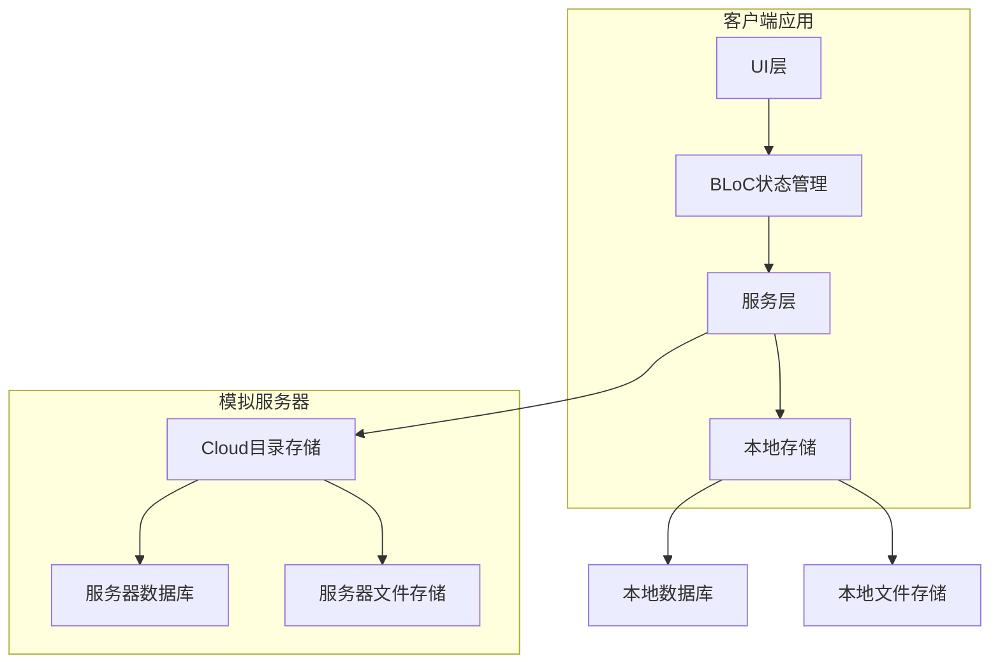
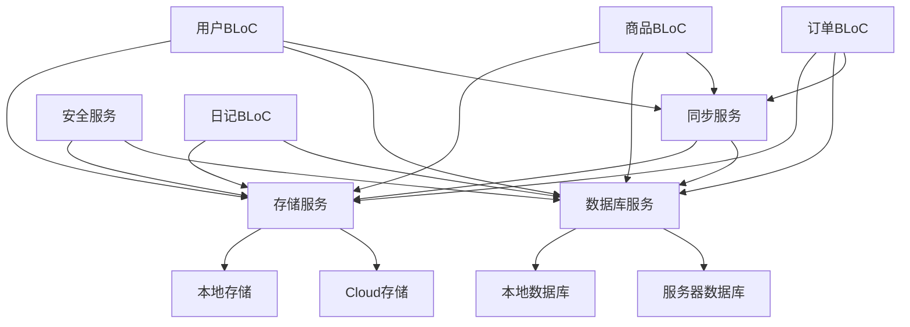
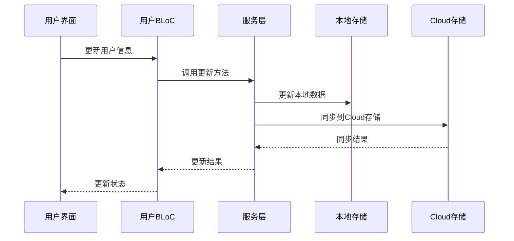
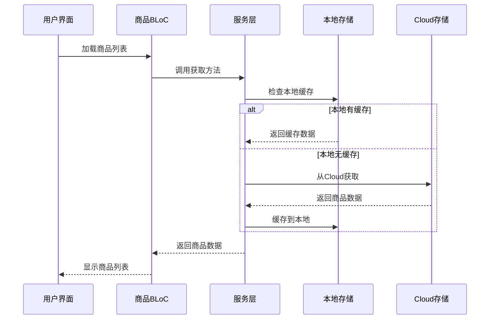
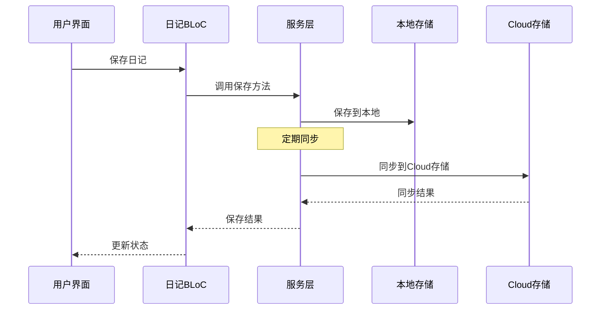

# 数据存放策略 - 设计阶段

## 1. 整体架构图

## 2. 分层设计和核心组件

### 2.1 客户端分层

#### 2.1.1 UI层
- **功能**: 展示数据和用户交互
- **组件**: 页面、表单、列表等
- **职责**: 调用BLoC获取数据，展示数据给用户

#### 2.1.2 BLoC层
- **功能**: 状态管理和业务逻辑
- **组件**: 各种BLoC类
- **职责**: 处理业务逻辑，管理状态，调用服务层方法

#### 2.1.3 服务层
- **功能**: 数据访问和业务服务
- **组件**: 数据库服务、存储服务、同步服务
- **职责**: 处理数据存储和同步，提供业务服务接口

#### 2.1.4 本地存储层
- **功能**: 本地数据存储
- **组件**: 本地数据库、本地文件存储
- **职责**: 存储本地数据，提供本地数据访问接口

### 2.2 模拟服务器层

#### 2.2.1 Cloud目录存储
- **功能**: 模拟服务器存储
- **组件**: 目录结构管理
- **职责**: 管理服务器目录结构，提供存储接口

#### 2.2.2 服务器数据库
- **功能**: 存储服务器端数据
- **组件**: 用户数据库、电商数据库
- **职责**: 存储用户和电商相关数据

#### 2.2.3 服务器文件存储
- **功能**: 存储服务器端文件
- **组件**: 商品文件、用户文件、系统文件
- **职责**: 存储各种服务器端文件

## 3. 模块依赖关系图

## 4. 接口契约定义

### 4.1 存储服务接口

#### 4.1.1 StorageService
- **方法**: `getFilePath(type, filename)`
  - **参数**: `type` (存储类型), `filename` (文件名)
  - **返回值**: 完整文件路径
  - **功能**: 获取文件存储路径

- **方法**: `saveFile(type, filename, data)`
  - **参数**: `type` (存储类型), `filename` (文件名), `data` (文件数据)
  - **返回值**: `bool` (是否成功)
  - **功能**: 保存文件

- **方法**: `readFile(type, filename)`
  - **参数**: `type` (存储类型), `filename` (文件名)
  - **返回值**: `Uint8List` (文件数据)
  - **功能**: 读取文件

- **方法**: `deleteFile(type, filename)`
  - **参数**: `type` (存储类型), `filename` (文件名)
  - **返回值**: `bool` (是否成功)
  - **功能**: 删除文件

### 4.2 数据库服务接口

#### 4.2.1 DatabaseService
- **方法**: `initialize()`
  - **参数**: 无
  - **返回值**: `Future<void>`
  - **功能**: 初始化数据库

- **方法**: `executeQuery(query, params)`
  - **参数**: `query` (SQL查询), `params` (查询参数)
  - **返回值**: `Future<dynamic>` (查询结果)
  - **功能**: 执行数据库查询

- **方法**: `beginTransaction()`
  - **参数**: 无
  - **返回值**: `Future<void>`
  - **功能**: 开始事务

- **方法**: `commitTransaction()`
  - **参数**: 无
  - **返回值**: `Future<void>`
  - **功能**: 提交事务

- **方法**: `rollbackTransaction()`
  - **参数**: 无
  - **返回值**: `Future<void>`
  - **功能**: 回滚事务

### 4.3 同步服务接口

#### 4.3.1 SyncService
- **方法**: `syncUserData()`
  - **参数**: 无
  - **返回值**: `Future<bool>` (是否成功)
  - **功能**: 同步用户数据

- **方法**: `syncProductData()`
  - **参数**: 无
  - **返回值**: `Future<bool>` (是否成功)
  - **功能**: 同步商品数据

- **方法**: `syncOrderData()`
  - **参数**: 无
  - **返回值**: `Future<bool>` (是否成功)
  - **功能**: 同步订单数据

- **方法**: `syncDiaryData()`
  - **参数**: 无
  - **返回值**: `Future<bool>` (是否成功)
  - **功能**: 同步日记数据

- **方法**: `syncFile(type, filename)`
  - **参数**: `type` (文件类型), `filename` (文件名)
  - **返回值**: `Future<bool>` (是否成功)
  - **功能**: 同步文件

## 5. 数据流向图

### 5.1 用户数据流向

### 5.2 商品数据流向

### 5.3 日记数据流向

## 6. 异常处理策略

### 6.1 存储异常
- **文件不存在**: 返回空数据或默认值
- **存储空间不足**: 提示用户清理空间
- **权限不足**: 提示用户授予权限
- **文件损坏**: 尝试恢复或使用备份

### 6.2 同步异常
- **同步失败**: 记录错误，下次重试
- **网络问题**: 切换到离线模式
- **数据冲突**: 提示用户解决冲突
- **同步超时**: 取消同步，下次重试

### 6.3 数据库异常
- **连接失败**: 尝试重新连接
- **查询错误**: 记录错误，返回空结果
- **事务失败**: 回滚事务，记录错误
- **数据损坏**: 尝试修复或使用备份

## 7. 设计原则

1. **数据分类原则**: 根据数据特性和业务需求确定存储位置
2. **安全优先原则**: 敏感数据加密存储，严格访问控制
3. **性能优化原则**: 本地存储常用数据，减少同步开销
4. **离线可用原则**: 确保核心功能在离线状态下正常使用
5. **可扩展性原则**: 设计灵活的存储架构，支持未来扩展
6. **兼容性原则**: 确保与现有系统架构兼容

## 8. 技术实现要点

1. **目录结构管理**: 自动创建和维护存储目录结构
2. **数据库管理**: 分离本地和服务器数据库，实现数据同步
3. **文件存储管理**: 统一文件存储接口，支持本地和Cloud存储
4. **数据同步**: 实现不同级别的同步策略
5. **数据安全**: 实现数据加密和访问控制
6. **存储优化**: 实现数据压缩和清理策略
7. **错误处理**: 完善的异常处理和恢复机制

## 9. 实施计划

1. **创建目录结构**: 实现目录结构的创建和管理
2. **实现存储服务**: 开发StorageService，支持本地和Cloud存储
3. **实现数据库服务**: 开发DatabaseService，支持本地和服务器数据库
4. **实现同步服务**: 开发SyncService，实现数据同步功能
5. **实现安全服务**: 开发SecurityService，实现数据安全功能
6. **集成到现有系统**: 将存储策略集成到现有Flutter项目
7. **测试验证**: 测试存储策略的正确性和可靠性