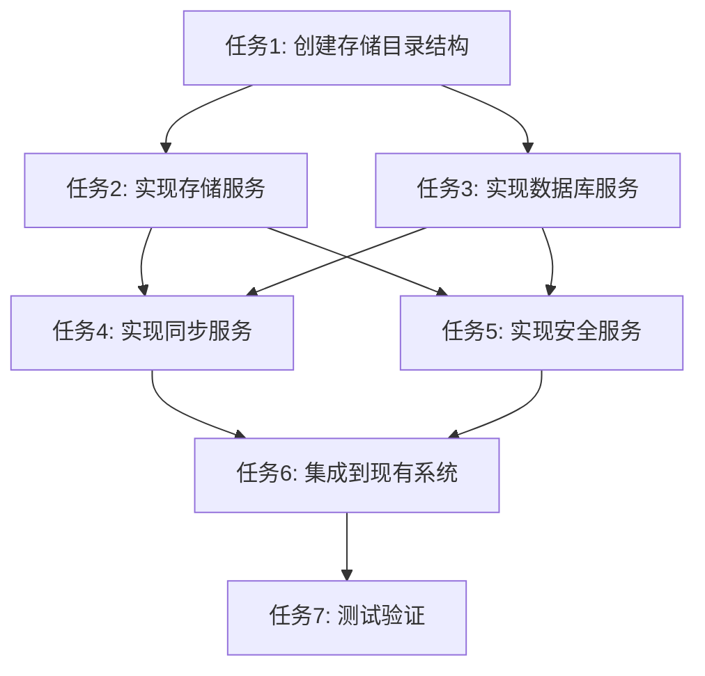

# 数据存放策略 - 原子化阶段

## 1. 子任务拆分

### 1.1 任务1: 创建存储目录结构

#### 输入契约
- **前置依赖**: 无
- **输入数据**: 无
- **环境依赖**: Flutter开发环境

#### 输出契约
- **输出数据**: 创建完成的目录结构
- **交付物**: 目录结构创建脚本
- **验收标准**: 成功创建cloud目录和本地目录结构

#### 实现约束
- **技术栈**: Dart
- **接口规范**: 遵循现有项目目录结构
- **质量要求**: 目录结构完整，权限设置正确

#### 依赖关系
- **后置任务**: 任务2、任务3

### 1.2 任务2: 实现存储服务

#### 输入契约
- **前置依赖**: 任务1
- **输入数据**: 目录结构
- **环境依赖**: Flutter开发环境

#### 输出契约
- **输出数据**: StorageService实现
- **交付物**: `lib/services/storage_service.dart`
- **验收标准**: 存储服务能够正确处理本地和Cloud存储

#### 实现约束
- **技术栈**: Dart
- **接口规范**: 符合设计文档中的接口定义
- **质量要求**: 代码规范，功能完整

#### 依赖关系
- **后置任务**: 任务4、任务5

### 1.3 任务3: 实现数据库服务

#### 输入契约
- **前置依赖**: 任务1
- **输入数据**: 目录结构
- **环境依赖**: Flutter开发环境，SQLite

#### 输出契约
- **输出数据**: DatabaseService实现
- **交付物**: `lib/services/database_service.dart`
- **验收标准**: 数据库服务能够正确处理本地和服务器数据库

#### 实现约束
- **技术栈**: Dart, SQLite
- **接口规范**: 符合设计文档中的接口定义
- **质量要求**: 代码规范，功能完整

#### 依赖关系
- **后置任务**: 任务4、任务5

### 1.4 任务4: 实现同步服务

#### 输入契约
- **前置依赖**: 任务2、任务3
- **输入数据**: StorageService, DatabaseService
- **环境依赖**: Flutter开发环境

#### 输出契约
- **输出数据**: SyncService实现
- **交付物**: `lib/services/sync_service.dart`
- **验收标准**: 同步服务能够正确同步数据

#### 实现约束
- **技术栈**: Dart
- **接口规范**: 符合设计文档中的接口定义
- **质量要求**: 代码规范，功能完整

#### 依赖关系
- **后置任务**: 任务6

### 1.5 任务5: 实现安全服务

#### 输入契约
- **前置依赖**: 任务2、任务3
- **输入数据**: StorageService, DatabaseService
- **环境依赖**: Flutter开发环境

#### 输出契约
- **输出数据**: SecurityService实现
- **交付物**: `lib/services/security_service.dart`
- **验收标准**: 安全服务能够正确保护数据

#### 实现约束
- **技术栈**: Dart
- **接口规范**: 符合设计文档中的接口定义
- **质量要求**: 代码规范，功能完整

#### 依赖关系
- **后置任务**: 任务6

### 1.6 任务6: 集成到现有系统

#### 输入契约
- **前置依赖**: 任务4、任务5
- **输入数据**: 所有服务实现
- **环境依赖**: Flutter开发环境

#### 输出契约
- **输出数据**: 集成完成的系统
- **交付物**: 更新后的现有文件
- **验收标准**: 存储策略与现有系统无缝集成

#### 实现约束
- **技术栈**: Dart
- **接口规范**: 遵循现有项目代码风格
- **质量要求**: 代码规范，无编译错误

#### 依赖关系
- **后置任务**: 任务7

### 1.7 任务7: 测试验证

#### 输入契约
- **前置依赖**: 任务6
- **输入数据**: 集成完成的系统
- **环境依赖**: Flutter开发环境

#### 输出契约
- **输出数据**: 测试结果
- **交付物**: 测试报告
- **验收标准**: 所有测试通过，功能正常

#### 实现约束
- **技术栈**: Dart, Flutter测试框架
- **接口规范**: 遵循测试最佳实践
- **质量要求**: 测试覆盖全面

#### 依赖关系
- **后置任务**: 无

## 2. 任务依赖图

## 3. 任务执行顺序

1. **任务1**: 创建存储目录结构
2. **任务2**: 实现存储服务
3. **任务3**: 实现数据库服务
4. **任务4**: 实现同步服务
5. **任务5**: 实现安全服务
6. **任务6**: 集成到现有系统
7. **任务7**: 测试验证

## 4. 任务执行说明

### 4.1 任务1: 创建存储目录结构
- **执行步骤**:
  1. 确定用户设置目录路径
  2. 创建cloud目录及其子目录
  3. 创建本地目录及其子目录
  4. 设置目录权限

### 4.2 任务2: 实现存储服务
- **执行步骤**:
  1. 创建StorageService类
  2. 实现文件路径获取方法
  3. 实现文件保存方法
  4. 实现文件读取方法
  5. 实现文件删除方法
  6. 测试存储服务功能

### 4.3 任务3: 实现数据库服务
- **执行步骤**:
  1. 创建DatabaseService类
  2. 实现数据库初始化方法
  3. 实现查询执行方法
  4. 实现事务管理方法
  5. 测试数据库服务功能

### 4.4 任务4: 实现同步服务
- **执行步骤**:
  1. 创建SyncService类
  2. 实现用户数据同步方法
  3. 实现商品数据同步方法
  4. 实现订单数据同步方法
  5. 实现日记数据同步方法
  6. 实现文件同步方法
  7. 测试同步服务功能

### 4.5 任务5: 实现安全服务
- **执行步骤**:
  1. 创建SecurityService类
  2. 实现数据加密方法
  3. 实现数据解密方法
  4. 实现访问控制方法
  5. 测试安全服务功能

### 4.6 任务6: 集成到现有系统
- **执行步骤**:
  1. 更新现有文件，集成存储服务
  2. 更新现有文件，集成数据库服务
  3. 更新现有文件，集成同步服务
  4. 更新现有文件，集成安全服务
  5. 测试集成后的系统

### 4.7 任务7: 测试验证
- **执行步骤**:
  1. 编写单元测试
  2. 编写集成测试
  3. 运行测试
  4. 分析测试结果
  5. 修复发现的问题

## 5. 验收标准

### 5.1 功能验收
- **目录结构**: 成功创建所有必要的目录
- **存储服务**: 能够正确存储和读取文件
- **数据库服务**: 能够正确操作数据库
- **同步服务**: 能够正确同步数据
- **安全服务**: 能够正确保护数据
- **系统集成**: 与现有系统无缝集成
- **测试验证**: 所有测试通过

### 5.2 质量验收
- **代码质量**: 代码规范，可读性好
- **性能质量**: 存储和同步操作性能良好
- **安全质量**: 敏感数据得到有效保护
- **可靠性**: 系统稳定，无崩溃
- **可维护性**: 代码结构清晰，易于维护

## 6. 风险评估

### 6.1 潜在风险
- **目录权限问题**: 可能无法创建或访问目录
- **存储空间不足**: 可能导致存储失败
- **数据同步冲突**: 可能导致数据不一致
- **安全漏洞**: 可能导致数据泄露
- **系统兼容性**: 可能与现有系统不兼容

### 6.2 风险缓解策略
- **目录权限问题**: 检查和请求必要的权限
- **存储空间不足**: 实现存储空间检查和提示
- **数据同步冲突**: 实现冲突检测和解决机制
- **安全漏洞**: 实现强加密和访问控制
- **系统兼容性**: 充分测试与现有系统的集成