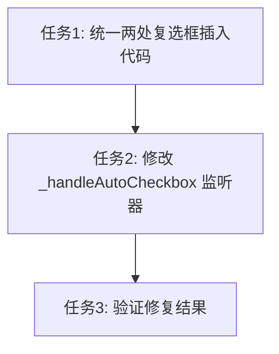

# 日记复选框插入问题修复任务

## 任务列表

### 任务1：统一两处复选框插入代码
- **输入契约**：
  - 现有代码有两处插入复选框的位置（第3615行和第3750行）
  - 两处代码逻辑不一致
- **输出契约**：
  - 两处代码使用完全相同的逻辑
  - 参考 `spec.md` 中的方案2
- **实现约束**：
  - 使用 `flutter_quill.BlockEmbed.custom` 插入复选框
  - 设置 `_isHandlingCheckbox = true` 防止监听器干扰
  - 使用 `try-finally` 确保标志被重置
- **依赖关系**：无

### 任务2：修改 `_handleAutoCheckbox` 监听器
- **输入契约**：
  - 现有 `_handleAutoCheckbox` 方法会在文档变化时触发
  - 可能会干扰手动插入复选框
- **输出契约**：
  - 当 `_isHandlingCheckbox = true` 时跳过处理
  - 确保不会覆盖手动插入的复选框
- **实现约束**：
  - 在方法开头检查 `_isHandlingCheckbox` 标志
  - 保持现有自动插入复选框的逻辑不变
- **依赖关系**：任务1

### 任务3：验证修复结果
- **输入契约**：
  - 修复后的代码
- **输出契约**：
  - Flutter analyze 无错误
  - 功能测试通过
- **验收标准**：
  1. 插入复选框后，光标自动出现在复选框后
  2. 可以立即输入文字，无需手动点击
  3. 输入文字后复选框不会出现乱码
  4. 复选框功能正常（点击可切换状态）
- **依赖关系**：任务1、任务2

## 任务依赖图

