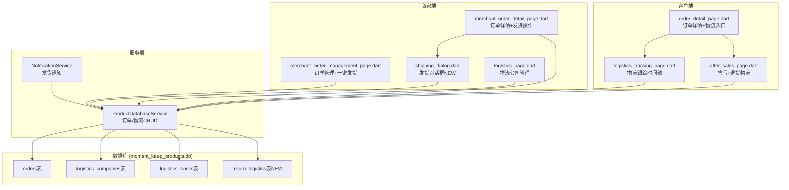
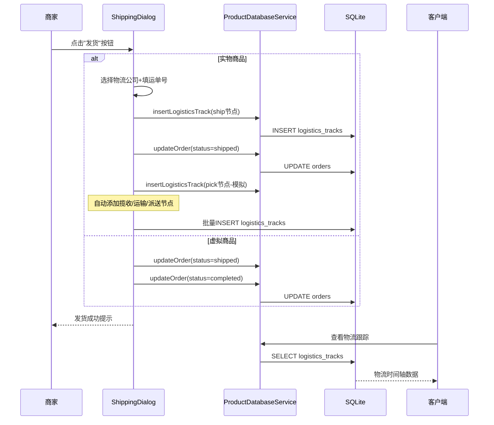

# DESIGN_物流系统.md

## 整体架构图

## 数据流设计

## 模块设计

### 1. ShippingDialog (新建)
- 文件: `lib/presentation/components/shipping_dialog.dart`
- 职责: 统一的发货操作入口
- 模式: 根据 `isElectronic` 切换实物/虚拟两种UI
- 实物模式: 物流公司下拉 + 运单号输入 + 发货按钮
- 虚拟模式: "确认无需物流发货"提示 + 确认按钮

### 2. ReturnLogisticsDialog (新建)
- 文件: `lib/presentation/components/return_logistics_dialog.dart`
- 职责: 退货物流录入
- 内容: 物流公司选择 + 退货运单号 + 提交按钮

### 3. 物流跟踪页优化 (修改)
- 文件: `lib/presentation/pages/logistics_tracking_page.dart`
- 优化: 进度条、节点状态图标、自动更新

### 4. 数据库服务扩展 (修改)
- 文件: `lib/services/product_database_service.dart`
- 新增: `return_logistics` CRUD, 物流节点批量插入