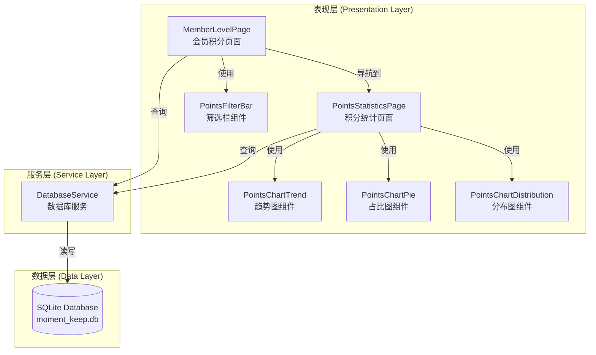
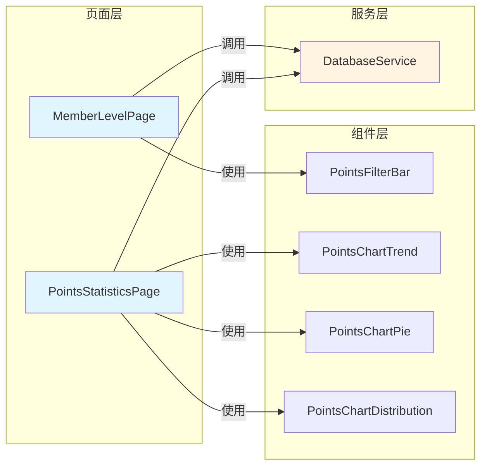
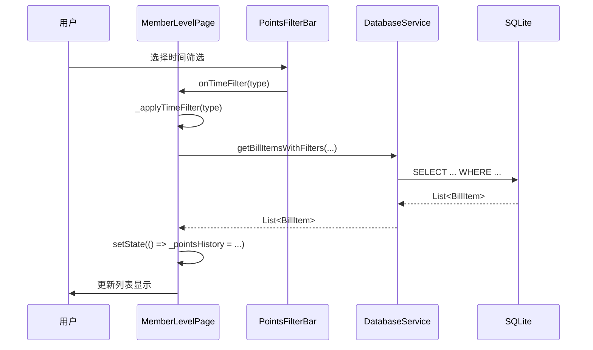
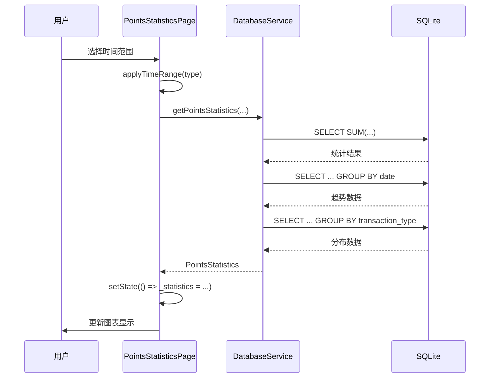

# 积分明细功能增强 - 架构设计文档

## 1. 整体架构图



## 2. 分层设计

### 2.1 表现层 (Presentation Layer)

#### 2.1.1 MemberLevelPage 扩展

**职责**：
- 展示会员等级和总积分
- 展示积分明细列表
- 提供筛选交互（时间、搜索、类型）
- 导航到统计页面

**新增状态变量**：
```dart
// 筛选状态
DateTime? _filterStartDate;
DateTime? _filterEndDate;
String _filterIncomeType = 'all'; // 'all', 'income', 'expense'
String _filterTransactionType = 'all';
String _searchKeyword = '';
bool _showCustomDateRange = false;
```

**新增方法**：
- `_applyTimeFilter(String type)` - 应用快速时间筛选
- `_toggleCustomDateRange()` - 切换自定义日期范围
- `_updateIncomeTypeFilter(String type)` - 更新收支类型筛选
- `_updateTransactionTypeFilter(String type)` - 更新交易类型筛选
- `_updateSearchKeyword(String keyword)` - 更新搜索关键词
- `_clearFilters()` - 清空所有筛选
- `_navigateToStatistics()` - 导航到统计页面

**修改方法**：
- `_getPointsHistory()` - 添加筛选参数支持

#### 2.1.2 PointsStatisticsPage 新建

**职责**：
- 展示收支统计概览
- 提供时间范围选择
- 展示各类图表
- 切换不同图表类型

**状态变量**：
```dart
// 时间范围
DateTime? _startDate;
DateTime? _endDate;
String _timeRangeType = 'month'; // 'week', 'month', 'year', 'custom'

// 图表类型
String _currentChartType = 'trend'; // 'trend', 'pie', 'distribution'

// 统计数据
PointsStatistics? _statistics;
bool _isLoading = false;
```

**核心方法**：
- `_loadStatistics()` - 加载统计数据
- `_applyTimeRange(String type)` - 应用时间范围
- `_switchChartType(String type)` - 切换图表类型

#### 2.1.3 PointsFilterBar 组件（可选）

**职责**：
- 封装筛选栏 UI
- 提供筛选回调

**Props**：
- `onTimeFilter: Function(String)`
- `onSearch: Function(String)`
- `onIncomeTypeFilter: Function(String)`
- `onTransactionTypeFilter: Function(String)`
- `onShowStatistics: VoidCallback`

### 2.2 服务层 (Service Layer)

#### 2.2.1 DatabaseService 扩展

**新增数据模型**（在 `database_service.dart` 顶部添加）：

```dart
/// 积分统计数据
class PointsStatistics {
  final double totalIncome;
  final double totalExpense;
  final double netIncome;
  final int transactionCount;
  final Map<String, double> typeDistribution;
  final List<TrendDataPoint> trendData;

  PointsStatistics({
    required this.totalIncome,
    required this.totalExpense,
    required this.netIncome,
    required this.transactionCount,
    required this.typeDistribution,
    required this.trendData,
  });
}

/// 趋势数据点
class TrendDataPoint {
  final DateTime date;
  final double income;
  final double expense;

  TrendDataPoint({
    required this.date,
    required this.income,
    required this.expense,
  });
}
```

**新增方法**：

```dart
/// 获取筛选后的账单明细
Future<List<BillItem>> getBillItemsWithFilters(
  String userId, {
  DateTime? startDate,
  DateTime? endDate,
  String? searchKeyword,
  String? incomeType,
  String? transactionType,
});

/// 获取收支统计数据
Future<PointsStatistics> getPointsStatistics(
  String userId,
  DateTime startDate,
  DateTime endDate,
);

/// 获取趋势数据（按日期分组）
Future<List<TrendDataPoint>> getBillTrendData(
  String userId,
  DateTime startDate,
  DateTime endDate,
);

/// 获取交易类型分布数据
Future<Map<String, double>> getBillTypeDistribution(
  String userId,
  DateTime startDate,
  DateTime endDate,
);
```

**修改现有方法**：

```dart
/// 扩展 getBillItems 方法，添加可选筛选参数
Future<List<BillItem>> getBillItems(
  String userId, {
  DateTime? startDate,
  DateTime? endDate,
  String? type,
  String? transactionType,
  String? searchKeyword,
});
```

### 2.3 数据层 (Data Layer)

**现有表结构保持不变**：

```sql
-- bills 表
CREATE TABLE bills (
  id TEXT PRIMARY KEY,
  user_id TEXT NOT NULL,
  balance INTEGER NOT NULL DEFAULT 0,
  income INTEGER NOT NULL DEFAULT 0,
  expense INTEGER NOT NULL DEFAULT 0,
  created_at INTEGER NOT NULL,
  updated_at INTEGER NOT NULL
);

-- bill_items 表
CREATE TABLE bill_items (
  id TEXT PRIMARY KEY,
  user_id TEXT NOT NULL,
  bill_id TEXT NOT NULL,
  amount INTEGER NOT NULL,
  type TEXT NOT NULL,
  transaction_type TEXT NOT NULL,
  description TEXT NOT NULL,
  created_at INTEGER NOT NULL,
  updated_at INTEGER NOT NULL,
  related_id TEXT,
  FOREIGN KEY (bill_id) REFERENCES bills(id) ON DELETE CASCADE
);
```

## 3. 模块依赖关系图



## 4. 接口契约定义

### 4.1 筛选接口

```dart
/// 时间筛选选项
enum TimeFilterType {
  today,
  thisWeek,
  thisMonth,
  thisYear,
  custom,
}

/// 收支类型筛选选项
enum IncomeTypeFilter {
  all,
  income,
  expense,
}

/// 交易类型筛选选项
enum TransactionTypeFilter {
  all,
  habitCompleted,
  exchange,
  refund,
  reward,
  expense,
}

/// 交易类型显示名称映射
const Map<String, String> transactionTypeNames = {
  'habit_completed': '习惯打卡',
  'exchange': '商品兑换',
  'refund': '退款',
  'reward': '奖励',
  'expense': '消费',
};
```

### 4.2 数据库查询接口

#### 4.2.1 getBillItemsWithFilters

**输入**：
- `userId: String` - 用户ID
- `startDate: DateTime?` - 开始日期
- `endDate: DateTime?` - 结束日期
- `searchKeyword: String?` - 搜索关键词
- `incomeType: String?` - 收支类型
- `transactionType: String?` - 交易类型

**输出**：
- `Future<List<BillItem>>` - 筛选后的账单明细列表

**SQL 示例**：
```sql
SELECT * FROM bill_items 
WHERE user_id = ?
  AND (? IS NULL OR created_at >= ?)
  AND (? IS NULL OR created_at <= ?)
  AND (? IS NULL OR description LIKE ?)
  AND (? IS NULL OR type = ?)
  AND (? IS NULL OR transaction_type = ?)
ORDER BY created_at DESC
```

#### 4.2.2 getPointsStatistics

**输入**：
- `userId: String` - 用户ID
- `startDate: DateTime` - 开始日期
- `endDate: DateTime` - 结束日期

**输出**：
- `Future<PointsStatistics>` - 统计数据对象

**SQL 示例**：
```sql
SELECT 
  SUM(CASE WHEN type = 'income' THEN amount ELSE 0 END) as total_income,
  SUM(CASE WHEN type = 'expense' THEN amount ELSE 0 END) as total_expense,
  COUNT(*) as transaction_count
FROM bill_items 
WHERE user_id = ?
  AND created_at >= ?
  AND created_at <= ?
```

#### 4.2.3 getBillTrendData

**输入**：
- `userId: String` - 用户ID
- `startDate: DateTime` - 开始日期
- `endDate: DateTime` - 结束日期

**输出**：
- `Future<List<TrendDataPoint>>` - 趋势数据列表

**SQL 示例**（按日期分组）：
```sql
SELECT 
  DATE(created_at / 1000, 'unixepoch') as date,
  SUM(CASE WHEN type = 'income' THEN amount ELSE 0 END) as income,
  SUM(CASE WHEN type = 'expense' THEN amount ELSE 0 END) as expense
FROM bill_items 
WHERE user_id = ?
  AND created_at >= ?
  AND created_at <= ?
GROUP BY DATE(created_at / 1000, 'unixepoch')
ORDER BY date
```

#### 4.2.4 getBillTypeDistribution

**输入**：
- `userId: String` - 用户ID
- `startDate: DateTime` - 开始日期
- `endDate: DateTime` - 结束日期

**输出**：
- `Future<Map<String, double>>` - 类型分布映射

**SQL 示例**：
```sql
SELECT 
  transaction_type,
  SUM(amount) as total
FROM bill_items 
WHERE user_id = ?
  AND created_at >= ?
  AND created_at <= ?
GROUP BY transaction_type
```

## 5. 数据流向图

### 5.1 积分明细筛选数据流



### 5.2 统计数据加载数据流



## 6. 异常处理策略

### 6.1 数据库异常

**可能的异常**：
- 数据库打开失败
- 查询语法错误
- 数据类型转换错误

**处理策略**：
```dart
try {
  final result = await db.rawQuery(sql, args);
  return result;
} catch (e) {
  debugPrint('数据库查询失败: $e');
  rethrow; // 或返回默认空数据
}
```

### 6.2 日期范围异常

**可能的异常**：
- 开始日期 > 结束日期
- 日期范围超出合理范围（如超过10年）

**处理策略**：
```dart
if (startDate.isAfter(endDate)) {
  // 自动交换日期
  final temp = startDate;
  startDate = endDate;
  endDate = temp;
}

// 限制最大日期范围
const maxRange = Duration(days: 365 * 10);
if (endDate.difference(startDate) > maxRange) {
  endDate = startDate.add(maxRange);
}
```

### 6.3 图表数据异常

**可能的异常**：
- 数据为空
- 数据值异常大或小

**处理策略**：
- 空数据显示友好提示
- 异常值进行裁剪或对数缩放
- 显示加载状态和错误状态

## 7. 性能优化策略

### 7.1 数据库查询优化

1. **使用索引**：
   - 已有的索引：`idx_bill_items_user_id`, `idx_bill_items_type`, `idx_bill_items_transaction_type`, `idx_bill_items_created_at`
   - 确保查询使用这些索引

2. **避免全表扫描**：
   - 总是提供 `user_id` 条件
   - 合理使用日期范围限制数据量

3. **分页加载**：
   - 如果积分明细数据量大，考虑实现分页
   - 使用 `LIMIT` 和 `OFFSET` 子句

### 7.2 前端性能优化

1. **防抖搜索**：
   - 搜索输入使用 debounce（300ms）
   - 避免每次按键都触发查询

2. **懒加载图表**：
   - 图表数据只在需要时加载
   - 使用 `FutureBuilder` 显示加载状态

3. **缓存策略**：
   - 统计数据可以短期缓存（如5分钟）
   - 避免重复查询相同时间范围的数据

---

**架构设计完成，可以进入 Atomize 阶段进行任务拆分**
