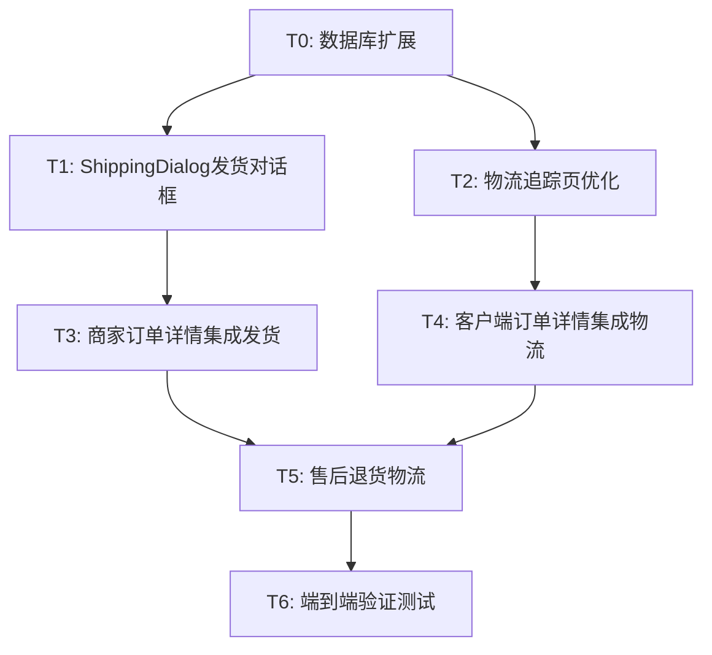

# TASK_物流系统.md

## 任务依赖图

## 原子任务定义

### T0: 数据库扩展 — return_logistics表 + orders字段
- **输入**: product_database_service.dart 现有建表逻辑
- **输出**: 
  - `return_logistics` 表创建（含_onCreate/_onUpgrade/_ensureTablesExist)
  - orders表 `logistics_company_id` 字段
  - 数据库版本号升级
  - 相关CRUD方法
- **验收**: 编译通过，表创建成功

### T1: ShippingDialog发货对话框（新建）
- **输入**: merchant_order_detail_page.dart 现有UI
- **输出**: shipping_dialog.dart 组件
  - 实物模式UI（物流公司选择器+运单号+发货）
  - 虚拟模式UI（无需物流确认）
  - 发货逻辑（插入物流轨迹+更新订单状态）
  - 错误处理和加载状态
- **验收**: 对话框正确展示，发货状态更新成功

### T2: 物流追踪页优化（修改）
- **输入**: logistics_tracking_page.dart
- **输出**: 
  - 进度条组件（展示物流进度百分比）
  - 优化时间轴UI（节点图标/颜色/连接线）
  - 物流节点自动推进（揽收→运输→派送→签收）
  - 物流异常状态显示
- **验收**: UI美观，节点显示正确

### T3: 商家订单详情集成发货入口（修改）
- **输入**: merchant_order_detail_page.dart
- **输出**: 
  - "待发货"状态显示"发货"按钮
  - 物流信息卡片优化（显示物流公司+运单号）
  - 发货后自动刷新页面
  - merchant_order_management_page 一键发货入口
- **验收**: 发货按钮可点击，发货成功后状态更新

### T4: 客户端订单详情物流入口优化（修改）
- **输入**: order_detail_page.dart
- **输出**: 
  - 添加"查看物流"按钮（已发货状态）
  - 物流状态进度显示
  - 跳转物流跟踪页
- **验收**: 可查看物流，状态进度正确

### T5: 售后退货物流（新建+修改）
- **输入**: after_sales_page.dart, merchant_order_detail_page.dart
- **输出**: 
  - return_logistics_dialog.dart 退货物流录入
  - 退货物流状态跟踪
  - 商家端退货物流查看
- **验收**: 退货物流可录入和查看

### T6: 端到端验证
- **输入**: 全部已修改文件
- **输出**: 验收报告
- **验收**: 
  - 实物商品发货→物流更新→签收→自动确认 全链路通过
  - 虚拟商品无需物流发货→自动完成 通过
  - 退货物流录入→跟踪 通过