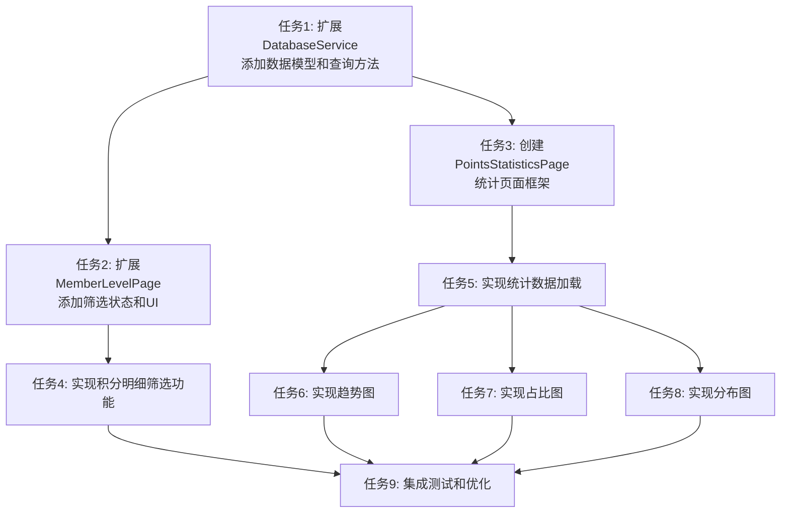

# 积分明细功能增强 - 任务拆分文档

## 1. 任务依赖图

## 2. 原子任务列表

### 任务 1: 扩展 DatabaseService - 添加数据模型和查询方法

**输入契约**：
- 前置依赖：无
- 输入数据：无
- 环境依赖：现有 database_service.dart 可正常编译

**输出契约**：
- 输出数据：
  - 新增 PointsStatistics 类
  - 新增 TrendDataPoint 类
  - 扩展 getBillItems 方法支持筛选参数
  - 新增 getPointsStatistics 方法
  - 新增 getBillTrendData 方法
  - 新增 getBillTypeDistribution 方法
- 交付物：可编译通过的 database_service.dart
- 验收标准：
  - 代码无编译错误
  - 数据模型定义完整
  - SQL 查询语法正确
  - 使用了现有的索引

**实现约束**：
- 技术栈：Dart, SQLite
- 接口规范：与现有 database_service.dart 风格一致
- 质量要求：添加必要的注释，错误处理完善

**依赖关系**：
- 后置任务：任务 2、任务 3
- 并行任务：无

---

### 任务 2: 扩展 MemberLevelPage - 添加筛选状态和UI

**输入契约**：
- 前置依赖：任务 1 完成
- 输入数据：无
- 环境依赖：现有 member_level_page.dart 可正常运行

**输出契约**：
- 输出数据：
  - 新增筛选状态变量
  - 新增筛选栏 UI 组件
  - 新增筛选相关方法
- 交付物：可编译通过的 member_level_page.dart
- 验收标准：
  - 筛选栏 UI 完整显示
  - 状态变量定义正确
  - 无编译错误

**实现约束**：
- 技术栈：Flutter, StatefulWidget
- 接口规范：与现有页面风格一致
- 质量要求：保持现有会员等级卡片不变

**依赖关系**：
- 后置任务：任务 4
- 并行任务：任务 3

---

### 任务 3: 创建 PointsStatisticsPage - 统计页面框架

**输入契约**：
- 前置依赖：任务 1 完成
- 输入数据：无
- 环境依赖：项目可正常编译

**输出契约**：
- 输出数据：
  - 新建 points_statistics_page.dart
  - 页面基础框架
  - 时间范围选择器
  - 概览卡片占位符
  - 图表切换标签
  - 图表区域占位符
- 交付物：可编译通过的 points_statistics_page.dart
- 验收标准：
  - 页面可正常导航进入
  - UI 框架完整
  - 无编译错误

**实现约束**：
- 技术栈：Flutter, Material Design 3
- 接口规范：与现有页面风格一致
- 质量要求：使用 AppBar, 返回按钮等基础组件

**依赖关系**：
- 后置任务：任务 5
- 并行任务：任务 2

---

### 任务 4: 实现积分明细筛选功能

**输入契约**：
- 前置依赖：任务 2 完成
- 输入数据：无
- 环境依赖：member_level_page.dart 筛选UI已就绪

**输出契约**：
- 输出数据：
  - 时间筛选功能（今天/本周/本月/本年/自定义）
  - 搜索功能（按描述搜索）
  - 收支类型筛选（全部/收入/支出）
  - 交易类型筛选（全部/习惯打卡/商品兑换/退款/等）
  - 组合筛选功能
  - 清空筛选功能
- 交付物：功能完整的 member_level_page.dart
- 验收标准：
  - 所有筛选功能正常工作
  - 筛选结果正确
  - 界面交互流畅

**实现约束**：
- 技术栈：Flutter
- 接口规范：调用任务 1 中扩展的数据库方法
- 质量要求：有加载状态，空数据提示

**依赖关系**：
- 后置任务：任务 9
- 并行任务：任务 5

---

### 任务 5: 实现统计数据加载

**输入契约**：
- 前置依赖：任务 3 完成
- 输入数据：无
- 环境依赖：points_statistics_page.dart 框架已就绪

**输出契约**：
- 输出数据：
  - _loadStatistics() 方法
  - 周/月/年/自定义时间范围统计
  - 概览卡片显示（总收入/总支出/净收入/交易次数）
  - 加载状态和错误状态
- 交付物：可正常加载统计数据的 points_statistics_page.dart
- 验收标准：
  - 统计数据正确加载
  - 时间范围切换正常
  - 概览数据计算正确

**实现约束**：
- 技术栈：Flutter, FutureBuilder
- 接口规范：调用任务 1 中的数据库方法
- 质量要求：异常处理完善

**依赖关系**：
- 后置任务：任务 6、任务 7、任务 8
- 并行任务：任务 4

---

### 任务 6: 实现趋势图

**输入契约**：
- 前置依赖：任务 5 完成
- 输入数据：统计数据已加载
- 环境依赖：fl_chart 依赖可用

**输出契约**：
- 输出数据：
  - 新增 PointsChartTrend 组件（可选）或直接在页面实现
  - 收支趋势折线图
  - X 轴日期，Y 轴金额
  - 两条线：收入（绿色）、支出（红色）
- 交付物：功能完整的趋势图
- 验收标准：
  - 图表正常显示
  - 数据正确渲染正确
  - 样式美观

**实现约束**：
- 技术栈：fl_chart, LineChart
- 接口规范：使用 PointsStatistics.trendData
- 质量要求：与应用主题一致

**依赖关系**：
- 后置任务：任务 9
- 并行任务：任务 7、任务 8

---

### 任务 7: 实现占比图

**输入契约**：
- 前置依赖：任务 5 完成
- 输入数据：统计数据已加载
- 环境依赖：fl_chart 依赖可用

**输出契约**：
- 输出数据：
  - 新增 PointsChartPie 组件（可选）或直接在页面实现
  - 收支占比饼图
  - 两个部分：收入、支出
- 交付物：功能完整的占比图
- 验收标准：
  - 图表正常显示
  - 占比计算正确
  - 样式美观

**实现约束**：
- 技术栈：fl_chart, PieChart
- 接口规范：使用 PointsStatistics.totalIncome/totalExpense
- 质量要求：与应用主题一致

**依赖关系**：
- 后置任务：任务 9
- 并行任务：任务 6、任务 8

---

### 任务 8: 实现分布图

**输入契约**：
- 前置依赖：任务 5 完成
- 输入数据：统计数据已加载
- 环境依赖：fl_chart 依赖可用

**输出契约**：
- 输出数据：
  - 新增 PointsChartDistribution 组件（可选）或直接在页面实现
  - 交易类型分布柱状图或饼图
  - 显示各交易类型的金额占比
- 交付物：功能完整的分布图
- 验收标准：
  - 图表正常显示
  - 分布数据正确
  - 样式美观

**实现约束**：
- 技术栈：fl_chart, BarChart 或 PieChart
- 接口规范：使用 PointsStatistics.typeDistribution
- 质量要求：与应用主题一致

**依赖关系**：
- 后置任务：任务 9
- 并行任务：任务 6、任务 7

---

### 任务 9: 集成测试和优化

**输入契约**：
- 前置依赖：任务 4、任务 6、任务 7、任务 8 完成
- 输入数据：无
- 环境依赖：所有功能已实现

**输出契约**：
- 输出数据：
  - 完整的端到端测试
  - 性能优化（如需要）
  - 边界情况处理
  - 用户体验优化
- 交付物：功能完整、体验良好的应用
- 验收标准：
  - 所有功能正常工作
  - 无明显 Bug
  - 界面流畅无卡顿

**实现约束**：
- 技术栈：Flutter
- 接口规范：无
- 质量要求：用户体验良好

**依赖关系**：
- 后置任务：无
- 并行任务：无

---

## 3. 任务执行顺序建议

### 第一阶段：基础设施
- 任务 1（必须最先完成）

### 第二阶段：并行开发
- 任务 2 和任务 3 可并行进行

### 第三阶段：功能实现
- 任务 4（积分明细筛选）
- 任务 5（统计数据加载）

### 第四阶段：图表开发
- 任务 6、任务 7、任务 8 可并行进行

### 第五阶段：集成测试
- 任务 9（最后完成）

## 4. 复杂度评估

| 任务 | 复杂度 | 预计工作量 |
|-----|---------|------------|
| 任务 1 | 中 | 2-3 小时 |
| 任务 2 | 中 | 2-3 小时 |
| 任务 3 | 低 | 1-2 小时 |
| 任务 4 | 高 | 3-4 小时 |
| 任务 5 | 中 | 2-3 小时 |
| 任务 6 | 中 | 2-3 小时 |
| 任务 7 | 低 | 1-2 小时 |
| 任务 8 | 中 | 2-3 小时 |
| 任务 9 | 中 | 2-3 小时 |
| **总计** | - | **17-26 小时 |

---

**任务拆分完成，可以进入 Approve 阶段进行审批**
