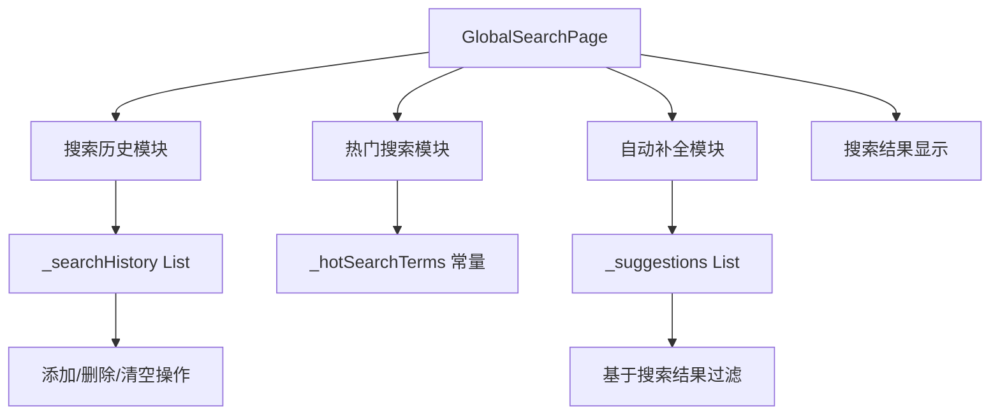
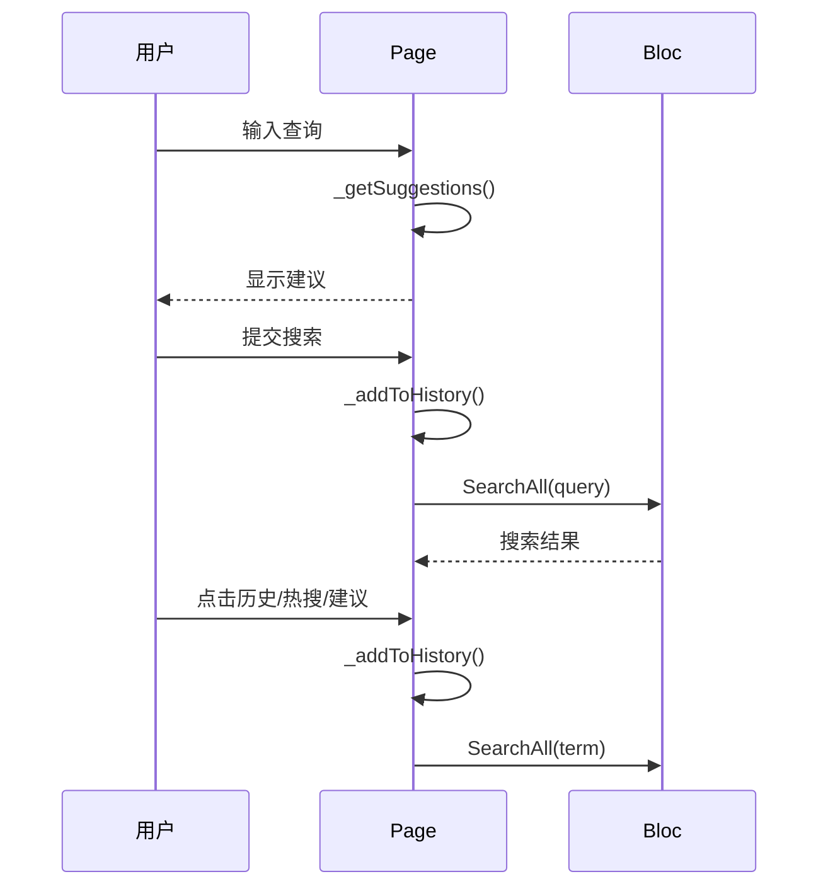

# 设计文档 - 全局搜索增强

## 整体架构



## 状态管理

### 新增状态变量
```dart
List<String> _searchHistory = [];           // 搜索历史
List<String> _suggestions = [];             // 自动建议
static const List<String> _hotSearchTerms = [...];  // 热门搜索
```

### 数据流
1. 用户输入 → 触发建议生成 → 显示建议列表
2. 用户提交搜索 → 添加到历史 → 执行搜索
3. 点击历史/热搜 → 执行搜索
4. 点击建议 → 执行搜索

## 组件设计

### UI 组件
1. **搜索历史区域**: Wrap + Chip 组件，带删除按钮
2. **热门搜索区域**: Wrap + Chip 组件，带火焰图标
3. **建议列表**: ListView.builder，带搜索图标
4. **初始内容**: Column 包含历史和热搜

### 交互逻辑
1. `_addToHistory(String query)`: 添加查询到历史（去重，保留最后10条）
2. `_removeFromHistory(String query)`: 从历史中删除指定项
3. `_clearHistory()`: 清空所有历史记录
4. `_getSuggestions(String query)`: 根据当前查询生成建议

## 数据流向图



## 异常处理
- 空查询时不添加到历史
- 历史已满时移除最旧的记录
- 重复查询时先删除再添加（保持最新）
