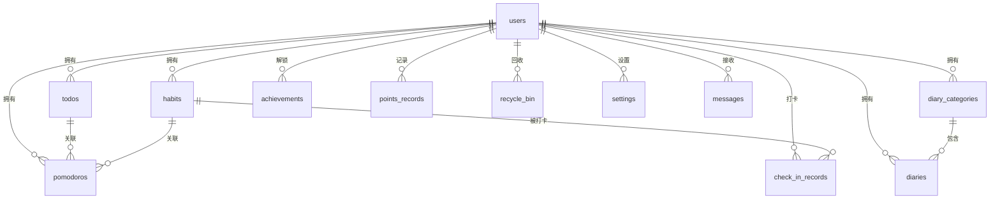

# 拾光记数据库设计文档

## 1. 数据库概述

拾光记应用使用 SQLite 作为本地数据库，通过 sqflite 库进行数据持久化。数据库设计遵循第三范式，保证数据的一致性和完整性。

### 1.1 数据库信息

- **数据库名称**：momentkeep.db
- **数据库版本**：1
- **字符集**：UTF-8
- **支持平台**：Android、iOS、Windows、macOS、Linux

### 1.2 数据库初始化

数据库在应用首次启动时自动创建，如果数据库版本升级，会自动执行迁移脚本。

## 2. 数据表设计

### 2.1 用户表 (users)

用户基本信息表，存储用户账号和密码。

```sql
CREATE TABLE users (
    id INTEGER PRIMARY KEY AUTOINCREMENT,
    username TEXT NOT NULL UNIQUE,
    password TEXT NOT NULL,
    email TEXT,
    phone TEXT,
    avatar TEXT,
    display_name TEXT,
    is_admin INTEGER DEFAULT 0,
    created_at INTEGER NOT NULL,
    updated_at INTEGER NOT NULL
);

CREATE INDEX idx_users_username ON users(username);
CREATE INDEX idx_users_email ON users(email);
```

**字段说明**：
- `id`: 用户 ID，主键，自增
- `username`: 用户名，唯一索引
- `password`: 密码（加密存储）
- `email`: 邮箱
- `phone`: 电话
- `avatar`: 头像路径
- `display_name`: 显示名称
- `is_admin`: 是否管理员（0: 否, 1: 是）
- `created_at`: 创建时间（时间戳）
- `updated_at`: 更新时间（时间戳）

### 2.2 待办事项表 (todos)

待办事项表，存储用户的待办事项。

```sql
CREATE TABLE todos (
    id INTEGER PRIMARY KEY AUTOINCREMENT,
    user_id INTEGER NOT NULL,
    title TEXT NOT NULL,
    description TEXT,
    priority INTEGER DEFAULT 1,
    is_completed INTEGER DEFAULT 0,
    due_date INTEGER,
    completed_at INTEGER,
    created_at INTEGER NOT NULL,
    updated_at INTEGER NOT NULL,
    is_deleted INTEGER DEFAULT 0,
    deleted_at INTEGER,
    FOREIGN KEY (user_id) REFERENCES users(id) ON DELETE CASCADE
);

CREATE INDEX idx_todos_user_id ON todos(user_id);
CREATE INDEX idx_todos_due_date ON todos(due_date);
CREATE INDEX idx_todos_is_completed ON todos(is_completed);
CREATE INDEX idx_todos_is_deleted ON todos(is_deleted);
```

**字段说明**：
- `id`: 待办事项 ID，主键，自增
- `user_id`: 用户 ID，外键关联 users 表
- `title`: 标题
- `description`: 描述
- `priority`: 优先级（0: 低, 1: 中, 2: 高）
- `is_completed`: 是否完成（0: 否, 1: 是）
- `due_date`: 截止日期（时间戳）
- `completed_at`: 完成时间（时间戳）
- `created_at`: 创建时间（时间戳）
- `updated_at`: 更新时间（时间戳）
- `is_deleted`: 是否删除（0: 否, 1: 是，软删除）
- `deleted_at`: 删除时间（时间戳）

### 2.3 习惯表 (habits)

习惯表，存储用户创建的习惯。

```sql
CREATE TABLE habits (
    id INTEGER PRIMARY KEY AUTOINCREMENT,
    user_id INTEGER NOT NULL,
    name TEXT NOT NULL,
    description TEXT,
    icon TEXT DEFAULT 'star',
    color INTEGER DEFAULT 4280375110,
    frequency INTEGER DEFAULT 0,
    target_days INTEGER DEFAULT 1,
    has_reminder INTEGER DEFAULT 0,
    reminder_times TEXT,
    start_date INTEGER NOT NULL,
    is_active INTEGER DEFAULT 1,
    created_at INTEGER NOT NULL,
    updated_at INTEGER NOT NULL,
    is_deleted INTEGER DEFAULT 0,
    deleted_at INTEGER,
    FOREIGN KEY (user_id) REFERENCES users(id) ON DELETE CASCADE
);

CREATE INDEX idx_habits_user_id ON habits(user_id);
CREATE INDEX idx_habits_is_active ON habits(is_active);
CREATE INDEX idx_habits_is_deleted ON habits(is_deleted);
```

**字段说明**：
- `id`: 习惯 ID，主键，自增
- `user_id`: 用户 ID，外键关联 users 表
- `name`: 习惯名称
- `description`: 习惯描述
- `icon`: 图标名称
- `color`: 颜色值
- `frequency`: 频率（0: 每日, 1: 每周）
- `target_days`: 目标天数
- `has_reminder`: 是否有提醒（0: 否, 1: 是）
- `reminder_times`: 提醒时间（JSON 格式的数组）
- `start_date`: 开始日期（时间戳）
- `is_active`: 是否激活（0: 否, 1: 是）
- `created_at`: 创建时间（时间戳）
- `updated_at`: 更新时间（时间戳）
- `is_deleted`: 是否删除（0: 否, 1: 是）
- `deleted_at`: 删除时间（时间戳）

### 2.4 打卡记录表 (check_in_records)

打卡记录表，存储习惯的打卡记录。

```sql
CREATE TABLE check_in_records (
    id INTEGER PRIMARY KEY AUTOINCREMENT,
    habit_id INTEGER NOT NULL,
    user_id INTEGER NOT NULL,
    date INTEGER NOT NULL,
    note TEXT,
    created_at INTEGER NOT NULL,
    FOREIGN KEY (habit_id) REFERENCES habits(id) ON DELETE CASCADE,
    FOREIGN KEY (user_id) REFERENCES users(id) ON DELETE CASCADE,
    UNIQUE(habit_id, date)
);

CREATE INDEX idx_checkin_habit_id ON check_in_records(habit_id);
CREATE INDEX idx_checkin_user_id ON check_in_records(user_id);
CREATE INDEX idx_checkin_date ON check_in_records(date);
```

**字段说明**：
- `id`: 打卡记录 ID，主键，自增
- `habit_id`: 习惯 ID，外键关联 habits 表
- `user_id`: 用户 ID，外键关联 users 表
- `date`: 打卡日期（时间戳）
- `note`: 打卡备注
- `created_at`: 创建时间（时间戳）

### 2.5 日记表 (diaries)

日记表，存储用户的日记内容。

```sql
CREATE TABLE diaries (
    id INTEGER PRIMARY KEY AUTOINCREMENT,
    user_id INTEGER NOT NULL,
    title TEXT NOT NULL,
    content TEXT NOT NULL,
    tags TEXT,
    category_id INTEGER,
    weather TEXT,
    mood TEXT,
    location TEXT,
    attachments TEXT,
    created_at INTEGER NOT NULL,
    updated_at INTEGER,
    is_deleted INTEGER DEFAULT 0,
    deleted_at INTEGER,
    FOREIGN KEY (user_id) REFERENCES users(id) ON DELETE CASCADE,
    FOREIGN KEY (category_id) REFERENCES diary_categories(id) ON DELETE SET NULL
);

CREATE INDEX idx_diaries_user_id ON diaries(user_id);
CREATE INDEX idx_diaries_created_at ON diaries(created_at);
CREATE INDEX idx_diaries_category_id ON diaries(category_id);
CREATE INDEX idx_diaries_is_deleted ON diaries(is_deleted);
```

**字段说明**：
- `id`: 日记 ID，主键，自增
- `user_id`: 用户 ID，外键关联 users 表
- `title`: 标题
- `content`: 内容（富文本或 Markdown）
- `tags`: 标签（JSON 格式的数组）
- `category_id`: 分类 ID，外键关联 diary_categories 表
- `weather`: 天气
- `mood`: 心情
- `location`: 位置
- `attachments`: 附件路径列表（JSON 格式的数组）
- `created_at`: 创建时间（时间戳）
- `updated_at`: 更新时间（时间戳）
- `is_deleted`: 是否删除（0: 否, 1: 是）
- `deleted_at`: 删除时间（时间戳）

### 2.6 日记分类表 (diary_categories)

日记分类表，存储日记的分类信息。

```sql
CREATE TABLE diary_categories (
    id INTEGER PRIMARY KEY AUTOINCREMENT,
    user_id INTEGER NOT NULL,
    name TEXT NOT NULL,
    color INTEGER DEFAULT 4280375110,
    icon TEXT DEFAULT 'folder',
    created_at INTEGER NOT NULL,
    updated_at INTEGER NOT NULL,
    is_deleted INTEGER DEFAULT 0,
    FOREIGN KEY (user_id) REFERENCES users(id) ON DELETE CASCADE
);

CREATE INDEX idx_diary_categories_user_id ON diary_categories(user_id);
```

**字段说明**：
- `id`: 分类 ID，主键，自增
- `user_id`: 用户 ID，外键关联 users 表
- `name`: 分类名称
- `color`: 颜色值
- `icon`: 图标名称
- `created_at`: 创建时间（时间戳）
- `updated_at`: 更新时间（时间戳）
- `is_deleted`: 是否删除（0: 否, 1: 是）

### 2.7 番茄钟记录表 (pomodoros)

番茄钟记录表，存储用户的番茄钟专注记录。

```sql
CREATE TABLE pomodoros (
    id INTEGER PRIMARY KEY AUTOINCREMENT,
    user_id INTEGER NOT NULL,
    duration INTEGER NOT NULL,
    note TEXT,
    start_time INTEGER NOT NULL,
    end_time INTEGER,
    is_completed INTEGER DEFAULT 0,
    todo_id INTEGER,
    habit_id INTEGER,
    created_at INTEGER NOT NULL,
    FOREIGN KEY (user_id) REFERENCES users(id) ON DELETE CASCADE,
    FOREIGN KEY (todo_id) REFERENCES todos(id) ON DELETE SET NULL,
    FOREIGN KEY (habit_id) REFERENCES habits(id) ON DELETE SET NULL
);

CREATE INDEX idx_pomodoros_user_id ON pomodoros(user_id);
CREATE INDEX idx_pomodoros_start_time ON pomodoros(start_time);
CREATE INDEX idx_pomodoros_is_completed ON pomodoros(is_completed);
```

**字段说明**：
- `id`: 番茄钟记录 ID，主键，自增
- `user_id`: 用户 ID，外键关联 users 表
- `duration`: 专注时长（秒）
- `note`: 备注
- `start_time`: 开始时间（时间戳）
- `end_time`: 结束时间（时间戳）
- `is_completed`: 是否完成（0: 否, 1: 是）
- `todo_id`: 关联的待办事项 ID
- `habit_id`: 关联的习惯 ID
- `created_at`: 创建时间（时间戳）

### 2.8 成就表 (achievements)

成就表，存储用户的成就信息。

```sql
CREATE TABLE achievements (
    id INTEGER PRIMARY KEY AUTOINCREMENT,
    user_id INTEGER NOT NULL,
    type TEXT NOT NULL,
    name TEXT NOT NULL,
    description TEXT,
    icon TEXT,
    points INTEGER DEFAULT 0,
    is_unlocked INTEGER DEFAULT 0,
    unlocked_at INTEGER,
    progress INTEGER DEFAULT 0,
    target INTEGER DEFAULT 1,
    created_at INTEGER NOT NULL,
    updated_at INTEGER NOT NULL,
    FOREIGN KEY (user_id) REFERENCES users(id) ON DELETE CASCADE
);

CREATE INDEX idx_achievements_user_id ON achievements(user_id);
CREATE INDEX idx_achievements_type ON achievements(type);
CREATE INDEX idx_achievements_is_unlocked ON achievements(is_unlocked);
```

**字段说明**：
- `id`: 成就 ID，主键，自增
- `user_id`: 用户 ID，外键关联 users 表
- `type`: 成就类型
- `name`: 成就名称
- `description`: 成就描述
- `icon`: 图标名称
- `points`: 积分
- `is_unlocked`: 是否已解锁（0: 否, 1: 是）
- `unlocked_at`: 解锁时间（时间戳）
- `progress`: 当前进度
- `target`: 目标值
- `created_at`: 创建时间（时间戳）
- `updated_at`: 更新时间（时间戳）

### 2.9 积分记录表 (points_records)

积分记录表，存储用户的积分获取和消耗记录。

```sql
CREATE TABLE points_records (
    id INTEGER PRIMARY KEY AUTOINCREMENT,
    user_id INTEGER NOT NULL,
    type TEXT NOT NULL,
    amount INTEGER NOT NULL,
    description TEXT,
    related_type TEXT,
    related_id INTEGER,
    created_at INTEGER NOT NULL,
    FOREIGN KEY (user_id) REFERENCES users(id) ON DELETE CASCADE
);

CREATE INDEX idx_points_user_id ON points_records(user_id);
CREATE INDEX idx_points_type ON points_records(type);
CREATE INDEX idx_points_created_at ON points_records(created_at);
```

**字段说明**：
- `id`: 记录 ID，主键，自增
- `user_id`: 用户 ID，外键关联 users 表
- `type`: 类型（earn: 获得, spend: 消耗）
- `amount`: 金额
- `description`: 描述
- `related_type`: 关联类型（todo, habit, pomodoro 等）
- `related_id`: 关联 ID
- `created_at`: 创建时间（时间戳）

### 2.10 回收站表 (recycle_bin)

回收站表，存储已删除的项目。

```sql
CREATE TABLE recycle_bin (
    id INTEGER PRIMARY KEY AUTOINCREMENT,
    user_id INTEGER NOT NULL,
    item_type TEXT NOT NULL,
    item_id INTEGER NOT NULL,
    item_data TEXT NOT NULL,
    deleted_at INTEGER NOT NULL,
    auto_delete_at INTEGER,
    FOREIGN KEY (user_id) REFERENCES users(id) ON DELETE CASCADE
);

CREATE INDEX idx_recycle_bin_user_id ON recycle_bin(user_id);
CREATE INDEX idx_recycle_bin_item_type ON recycle_bin(item_type);
CREATE INDEX idx_recycle_bin_deleted_at ON recycle_bin(deleted_at);
```

**字段说明**：
- `id`: 记录 ID，主键，自增
- `user_id`: 用户 ID，外键关联 users 表
- `item_type`: 项目类型（todo, habit, diary 等）
- `item_id`: 项目 ID
- `item_data`: 项目数据（JSON 格式）
- `deleted_at`: 删除时间（时间戳）
- `auto_delete_at`: 自动删除时间（时间戳）

### 2.11 设置表 (settings)

设置表，存储用户的设置信息。

```sql
CREATE TABLE settings (
    id INTEGER PRIMARY KEY AUTOINCREMENT,
    user_id INTEGER NOT NULL,
    key TEXT NOT NULL,
    value TEXT,
    created_at INTEGER NOT NULL,
    updated_at INTEGER NOT NULL,
    FOREIGN KEY (user_id) REFERENCES users(id) ON DELETE CASCADE,
    UNIQUE(user_id, key)
);

CREATE INDEX idx_settings_user_id ON settings(user_id);
CREATE INDEX idx_settings_key ON settings(key);
```

**字段说明**：
- `id`: 设置 ID，主键，自增
- `user_id`: 用户 ID，外键关联 users 表
- `key`: 设置键
- `value`: 设置值
- `created_at`: 创建时间（时间戳）
- `updated_at`: 更新时间（时间戳）

### 2.12 消息表 (messages)

消息表，存储系统消息。

```sql
CREATE TABLE messages (
    id INTEGER PRIMARY KEY AUTOINCREMENT,
    user_id INTEGER NOT NULL,
    type TEXT NOT NULL,
    title TEXT NOT NULL,
    content TEXT,
    is_read INTEGER DEFAULT 0,
    created_at INTEGER NOT NULL,
    FOREIGN KEY (user_id) REFERENCES users(id) ON DELETE CASCADE
);

CREATE INDEX idx_messages_user_id ON messages(user_id);
CREATE INDEX idx_messages_is_read ON messages(is_read);
CREATE INDEX idx_messages_created_at ON messages(created_at);
```

**字段说明**：
- `id`: 消息 ID，主键，自增
- `user_id`: 用户 ID，外键关联 users 表
- `type`: 消息类型（system, achievement, reminder 等）
- `title`: 标题
- `content`: 内容
- `is_read`: 是否已读（0: 否, 1: 是）
- `created_at`: 创建时间（时间戳）

## 3. 数据库关系图



## 4. 数据库操作

### 4.1 创建数据库

```dart
Future<Database> getDatabase() async {
  final databasePath = await getDatabasesPath();
  final path = join(databasePath, 'momentkeep.db');

  return await openDatabase(
    path,
    version: 1,
    onCreate: _onCreate,
    onUpgrade: _onUpgrade,
  );
}

Future<void> _onCreate(Database db, int version) async {
  // 创建所有表
  await db.execute('''
    CREATE TABLE users (
      id INTEGER PRIMARY KEY AUTOINCREMENT,
      username TEXT NOT NULL UNIQUE,
      password TEXT NOT NULL,
      ...
    )
  ''');

  // 创建其他表...
}
```

### 4.2 数据库迁移

```dart
Future<void> _onUpgrade(Database db, int oldVersion, int newVersion) async {
  if (oldVersion < 2) {
    // 添加新字段
    await db.execute('ALTER TABLE todos ADD COLUMN is_important INTEGER DEFAULT 0');
  }

  if (oldVersion < 3) {
    // 创建新表
    await db.execute('''
      CREATE TABLE new_table (
        id INTEGER PRIMARY KEY AUTOINCREMENT,
        ...
      )
    ''');
  }
}
```

### 4.3 常用查询

#### 4.3.1 查询待办事项

```dart
Future<List<Todo>> getTodosByUserId(int userId) async {
  final db = await database;
  final List<Map<String, dynamic>> maps = await db.query(
    'todos',
    where: 'user_id = ? AND is_deleted = 0',
    whereArgs: [userId],
    orderBy: 'due_date ASC',
  );
  return List.generate(maps.length, (i) => Todo.fromMap(maps[i]));
}
```

#### 4.3.2 查询习惯打卡统计

```dart
Future<int> getCheckInCount(int habitId, DateTime startDate, DateTime endDate) async {
  final db = await database;
  final result = await db.rawQuery('''
    SELECT COUNT(*) as count
    FROM check_in_records
    WHERE habit_id = ? AND date >= ? AND date <= ?
  ''', [habitId, startDate.millisecondsSinceEpoch, endDate.millisecondsSinceEpoch]);

  return Sqflite.firstIntValue(result) ?? 0;
}
```

#### 4.3.3 查询番茄钟总时长

```sql
SELECT
  DATE(start_time, 'unixepoch') as date,
  SUM(duration) as total_duration,
  COUNT(*) as count
FROM pomodoros
WHERE user_id = ? AND is_completed = 1
  AND start_time >= ? AND start_time <= ?
GROUP BY DATE(start_time, 'unixepoch')
ORDER BY date DESC;
```

## 5. 性能优化

### 5.1 索引策略

为频繁查询的字段创建索引：
- 外键字段
- 日期字段
- 状态字段（is_deleted, is_completed 等）
- 筛选字段（type, category_id 等）

### 5.2 查询优化

- 使用 LIMIT 分页查询
- 避免使用 SELECT *
- 合理使用索引
- 使用 JOIN 减少查询次数

### 5.3 数据维护

定期清理软删除的数据：
```sql
DELETE FROM todos
WHERE is_deleted = 1 AND deleted_at < ?
-- 30天前
```

## 6. 备份与恢复

### 6.1 备份数据库

```dart
Future<void> backupDatabase(String backupPath) async {
  final database = await getDatabase();
  final data = await database.getPath();

  final file = File(data);
  await file.copy(backupPath);
}
```

### 6.2 恢复数据库

```dart
Future<void> restoreDatabase(String backupPath) async {
  final database = await getDatabase();
  await database.close();

  final backupFile = File(backupPath);
  final databasePath = await getDatabasesPath();
  final dbPath = join(databasePath, 'momentkeep.db');

  await backupFile.copy(dbPath);
}
```

## 7. 数据安全

### 7.1 密码加密

用户密码使用加密存储：
```dart
String hashPassword(String password) {
  final bytes = utf8.encode(password);
  final hash = sha256.convert(bytes);
  return hash.toString();
}
```

### 7.2 数据加密

敏感数据可以加密存储：
```dart
String encryptData(String data, String key) {
  final encrypter = Encrypter(AES(Key.fromUtf8(key)));
  final encrypted = encrypter.encrypt(data);
  return encrypted.base64;
}
```

---

**最后更新**：2026-02-02
**文档版本**：1.0.0
